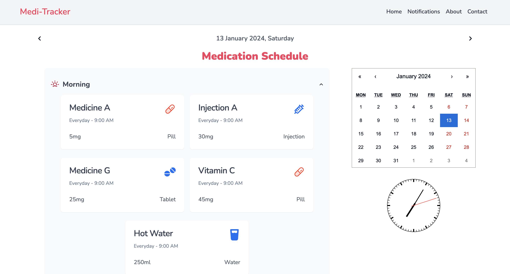

# Medi-Tracker

Welcome to Medi-Tracker a revolutionary health and wellness application designed specifically for individuals aged 65 and above. Our mission is to empower seniors like Sunita Sharma to lead healthier, more fulfilling lives through the use of cutting-edge technology.

## Demo




## Features

- Personalized Health Insights
- Medication Reminders
- Physical Activity Tracking
- Nutrition Guidance

## Acknowledgements

- [ReactJS](https://react.dev)
- [Next JS](https://nextjs.org)
- [Tailwind CSS](https://tailwindcss.com)

## How to Start the Project

Follow these steps to run the Medi-tracker on your local machine:

1. **Clone the Repository**:
   Clone this repository to your local machine using the following command:

   ```bash
   git clone https://github.com/kabhinav577/medi-track.git
   ```

2. Navigate to the Project Directory:

   ```
   cd medi-track

   ```

3. Install Dependencies:

   ```
   npm install

   ```

4. Start the Development Server:
   ```
   npm run dev
   ```
5. Access the App:
   ```
   Open your web browser and navigate to http://localhost:3000 to access the medi-track app.
   ```

## Authors

- [@krishna Kant singh](https://www.github.com/kabhinav577)
